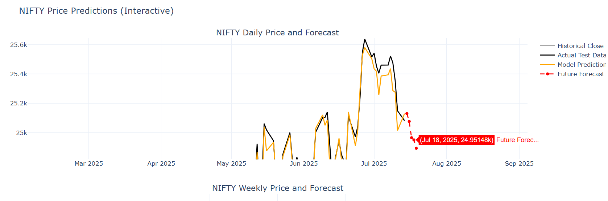
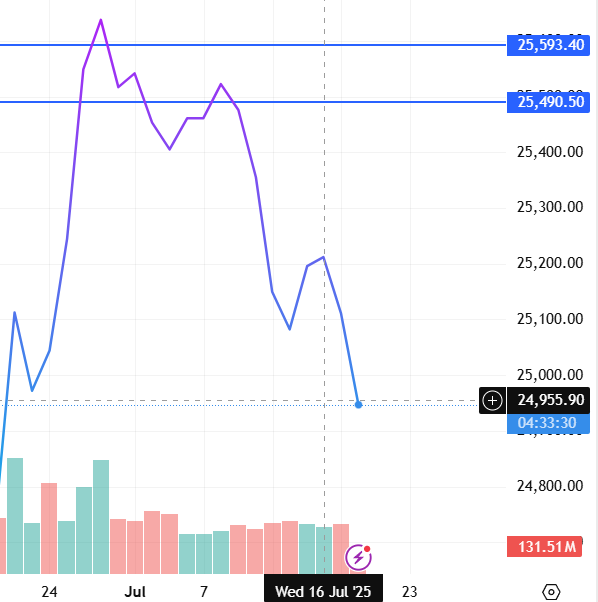
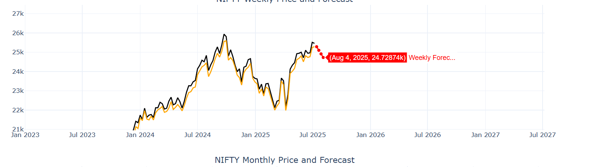
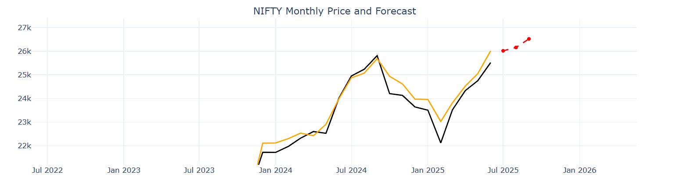

# 📈 NIFTY Price Prediction Model

A robust machine learning project designed to predict the **NIFTY 50 Index** using technical indicators and time-based features. This model is capable of forecasting **daily**, **weekly**, and **monthly** price levels using **XGBoost** regression with well-engineered inputs derived from price action and momentum.

---

## 🖼️ Forecast Images

### 🔮 Daily Forecast (ML-based)
Model-generated price forecast for the upcoming trading sessions:


### ✅ Real Market vs Predicted Result
Actual NIFTY levels vs predicted levels using the ML model:


### 📅 Weekly Forecast View
Model’s medium-term forecast using weekly-aggregated OHLC data:


### 📆 Monthly Forecast View
Longer-term prediction using monthly OHLC aggregation:


---

## 🚀 Features

- 📅 **Multi-Timeframe Support**: Daily, Weekly, Monthly predictions
- 📊 **16+ Features**: Includes RSI, MACD, EMA, Bollinger Band Width, Lag values, and volatility
- 🧠 **ML with XGBoost**: Uses gradient boosting regression on engineered features
- 📈 **Interactive Visualizations**: Plotly-based charts for visual backtesting
- 🔁 **Future Price Forecasting**: Predicts future price trends iteratively
- ⚙️ **Modular Codebase**: Easy to extend for additional timeframes or instruments

---

## 📊 Model Performance Summary

| Timeframe | Description                      | Evaluation Metric |
|-----------|----------------------------------|-------------------|
| **Daily** | Short-term price movement        | RMSE optimized    |
| **Weekly**| Mid-term market trends           | RMSE              |
| **Monthly**| Long-term market outlook        | RMSE              |

> ✅ Models trained using last 80% of available data, tested on the remaining 20%.

---

## 🧾 Input Data Requirements

The model expects historical NIFTY data in CSV format located in the `data/` folder.

### Expected Columns:

| Column | Description       |
|--------|-------------------|
| Date   | Format: YYYY-MM-DD|
| Open   | Opening price     |
| High   | Highest price     |
| Low    | Lowest price      |
| Close  | Closing price     |

### Example:

```csv
Date,Open,High,Low,Close
2024-01-01,21600,21750,21500,21690
2024-01-02,21700,21800,21620,21740
